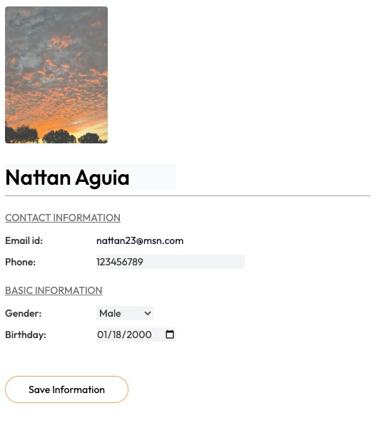
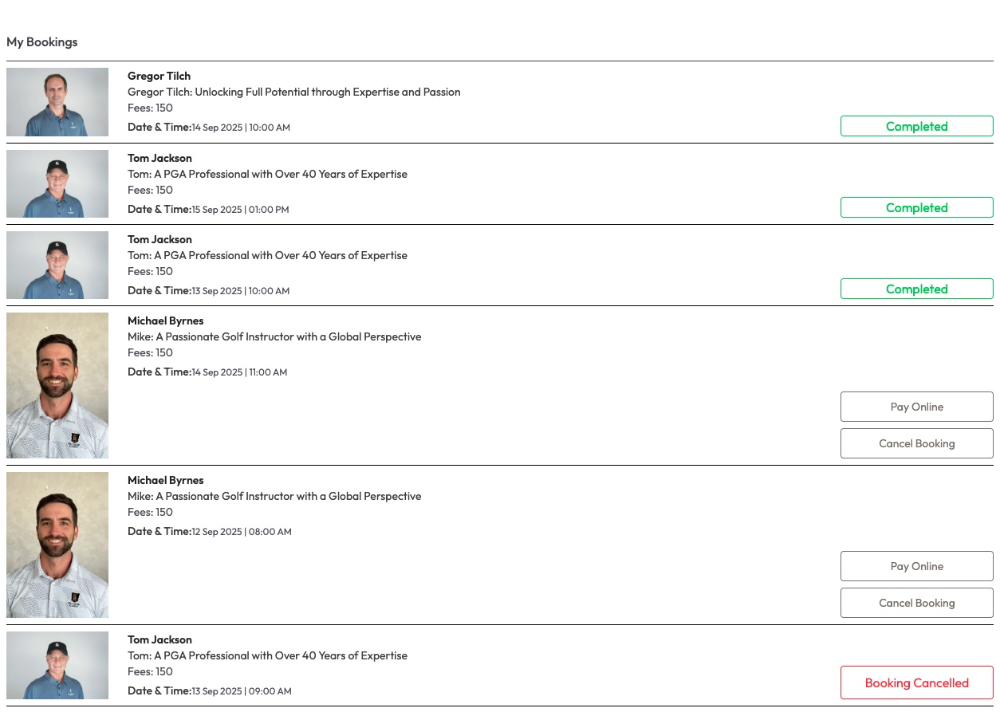
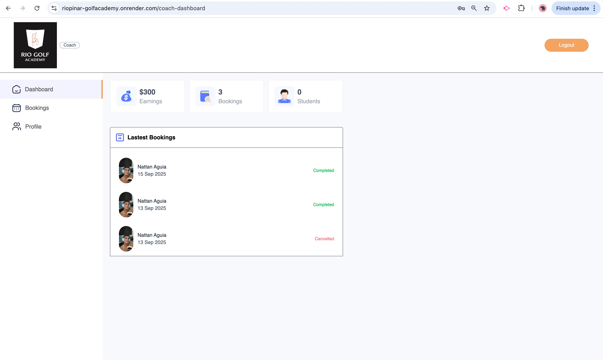
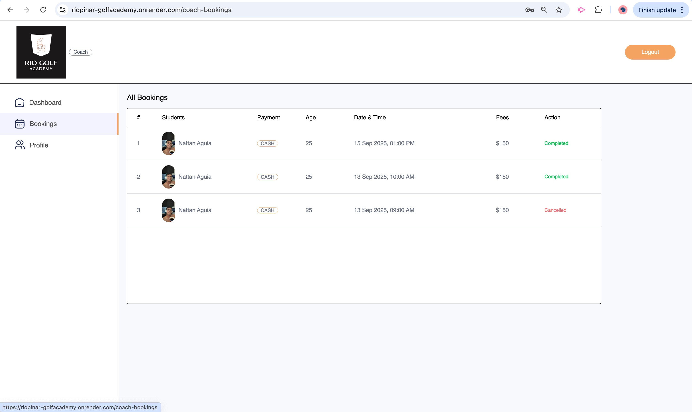
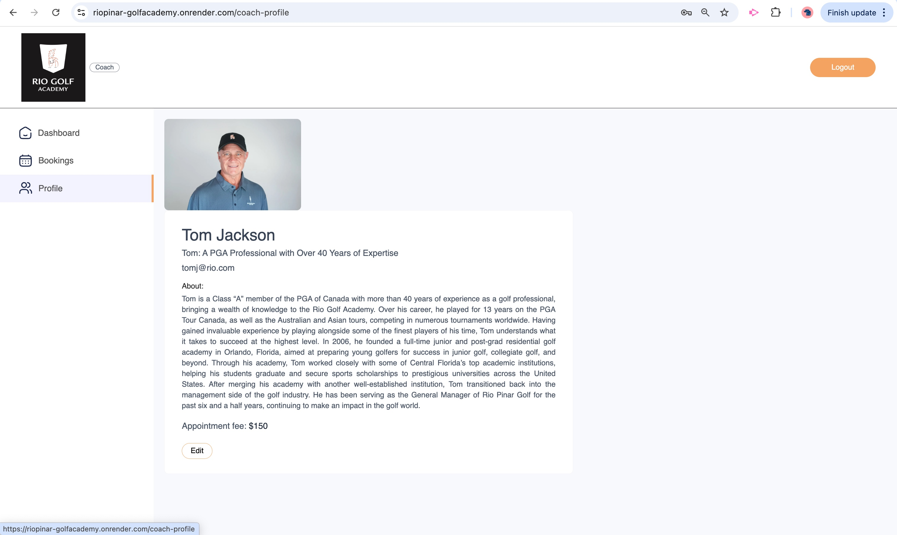
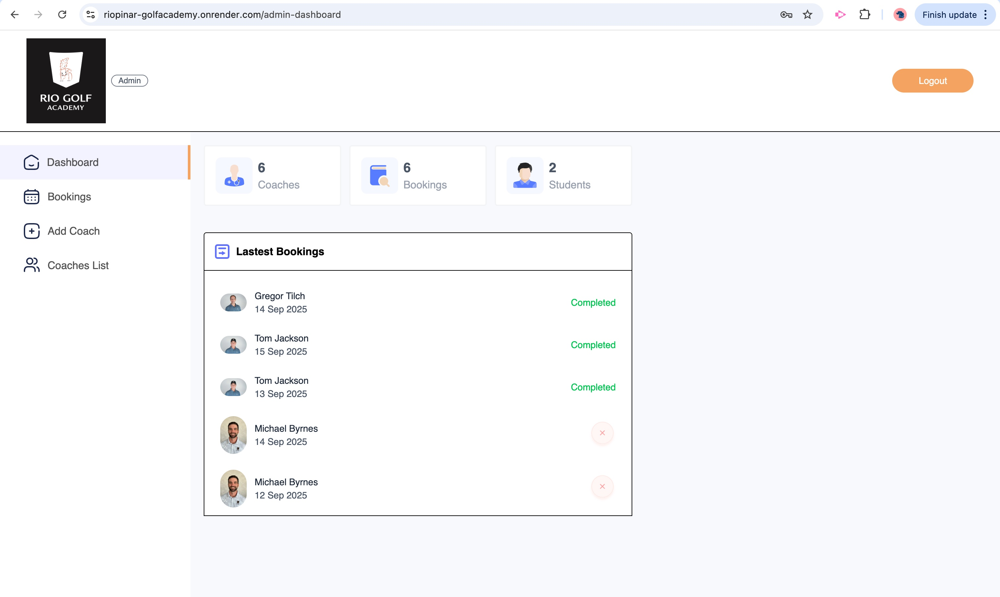
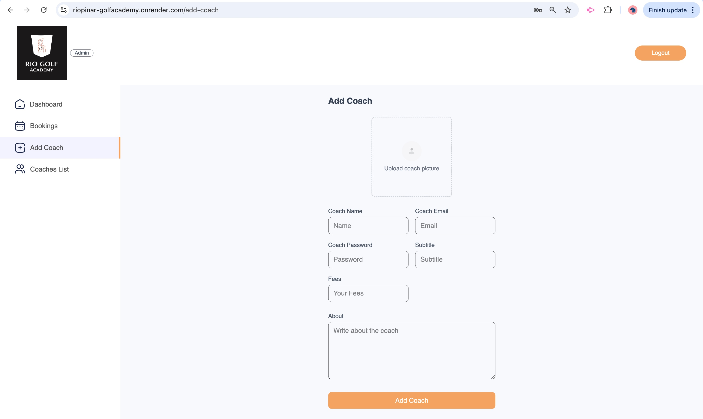
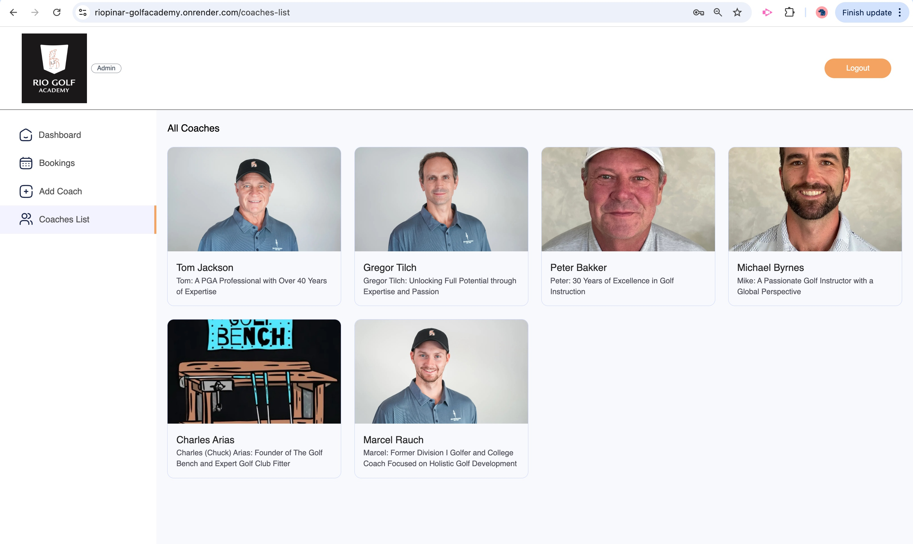
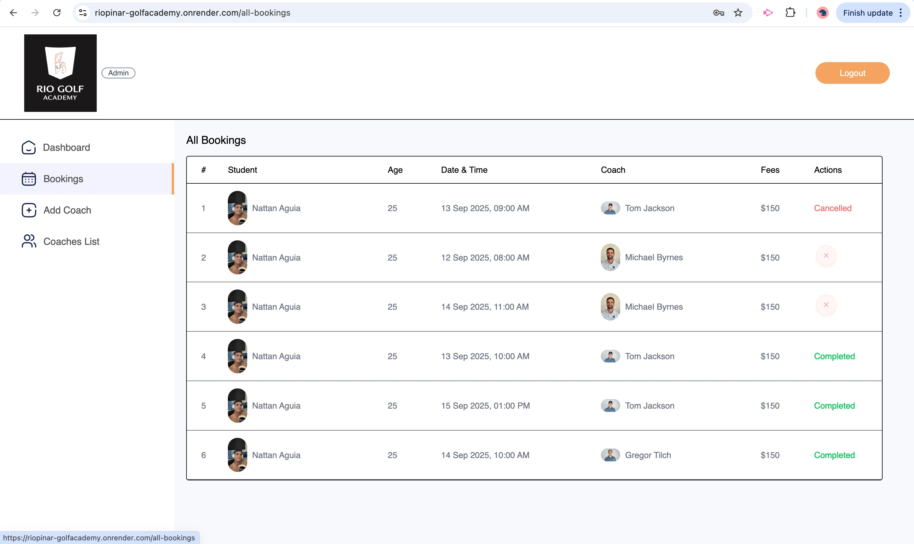

# Rio Pinar Golf Academy

## Project Overview

Rio Golf Academy is a MERN-stack web application that allows students to book golf lessons, coaches to manage their schedules, and admins to oversee the entire system.

## Technologies Used

* MongoDB
* Express.js
* React
* Node.js
* Tailwind CSS
* Cloudinary

## Local Installation & Deployment

Steps for setup (clone repo, install dependencies, configure .env, run backend & frontend).

## Functional Modules

### Landing Page

* Intro banner, navigation, call-to-action button.

## User Registration & Login

* Create account form (Full Name, Email, Password).
* Login form for existing users.

## Student Profile & Booking

* Edit profile details.
* View bookings (Completed / Cancelled).
* Cancel bookings.

## Coaches Section

* Browse all coaches
* View detailed profile(bio, fee, availability).
* Book a session.

## Coach Dashboard

* Login for coaches.
* Dashboard with earnings, bookings, students.
* Booking list with details.
* Edit coach profile.

## Admin Panel

* Admin login.
* Dashboard with stats(coaches, bookings, students).
* Add new coach(from with Cloudinary upload).
* View/edit coach list.
* Manage all bookings.

## Contact & Credits

Developer: Nattan Aguia

GitHub: [Nattan Aguia Trujillo](https://github.com/nattanaguiat)

If you have additional questions, please contact me by email at [nattan23@msn.com](nattan.aguia@gmail.com)